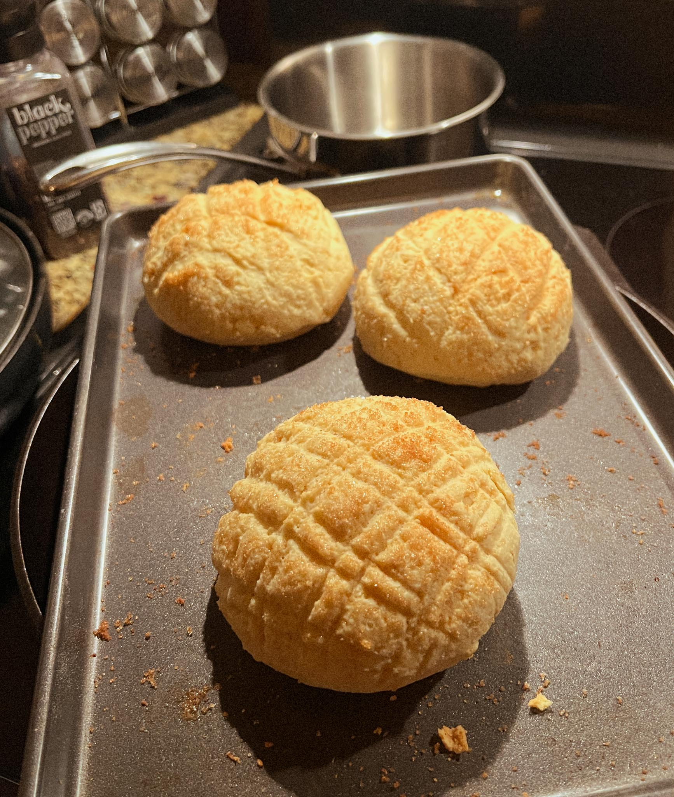
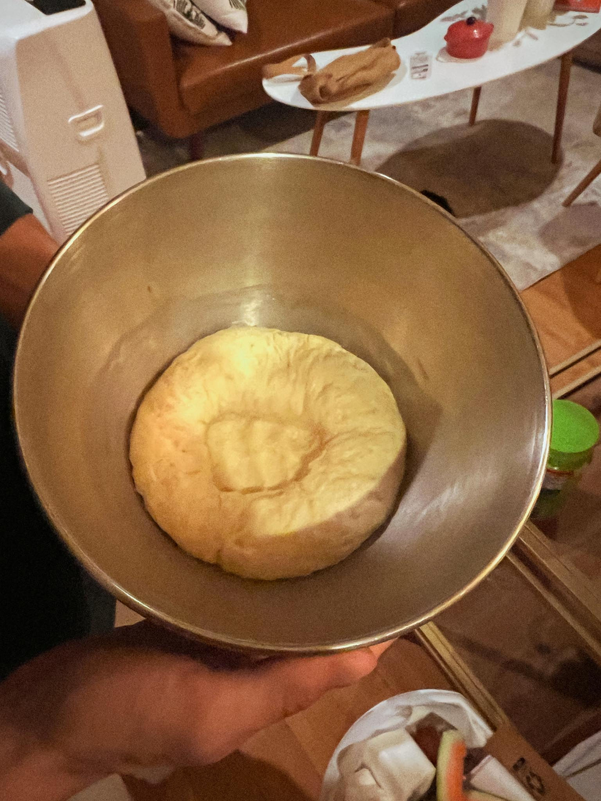

---
title: melon pan
keywords: [melon pan]
...

### summary
Japanese pastry with 

### ingredients
<u>Ingredient</u> | <u>Amount</u>
---    | ---
Item 1 | 100g
Item 2 | 250ml

### method
1. Making the dough
    - asdasd
2. Making
    - asdasd
3. Combining and Baking
    - asdasd

