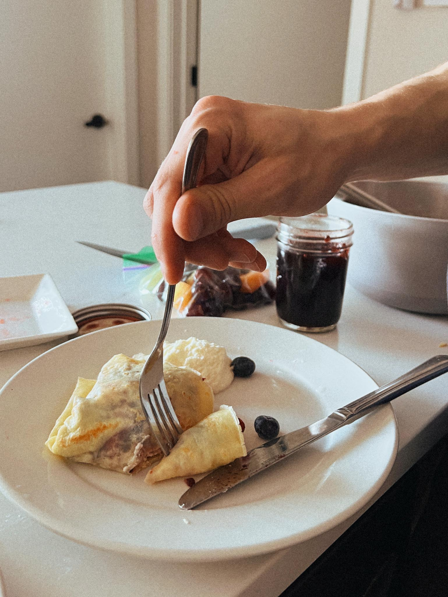
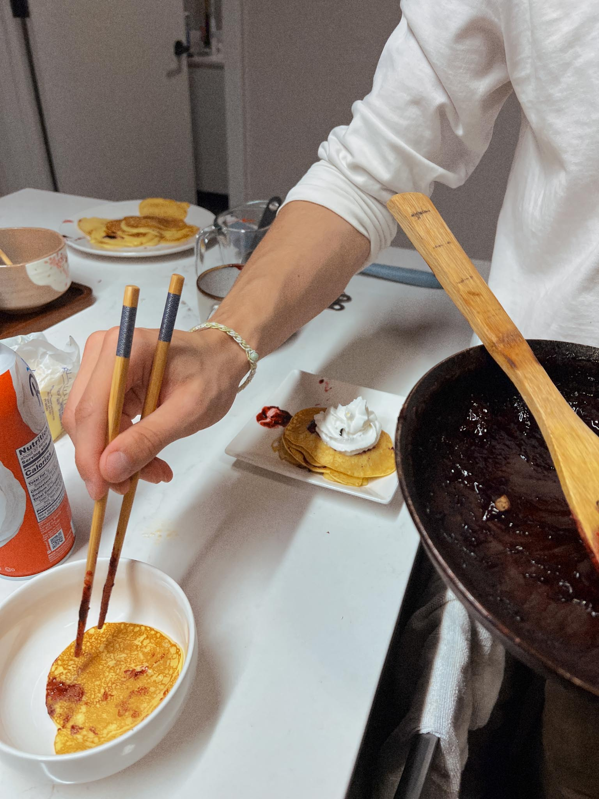
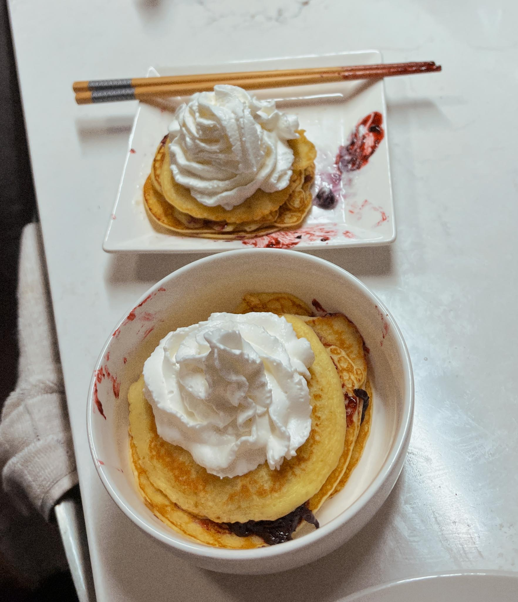
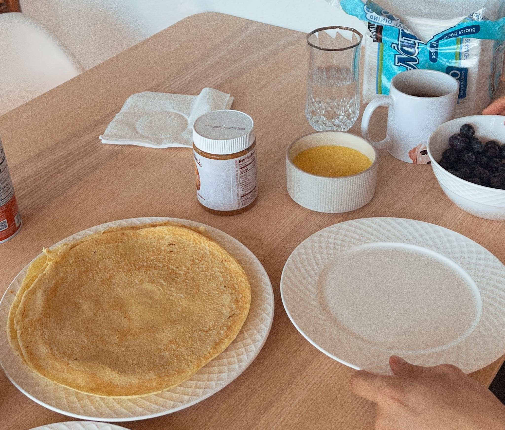
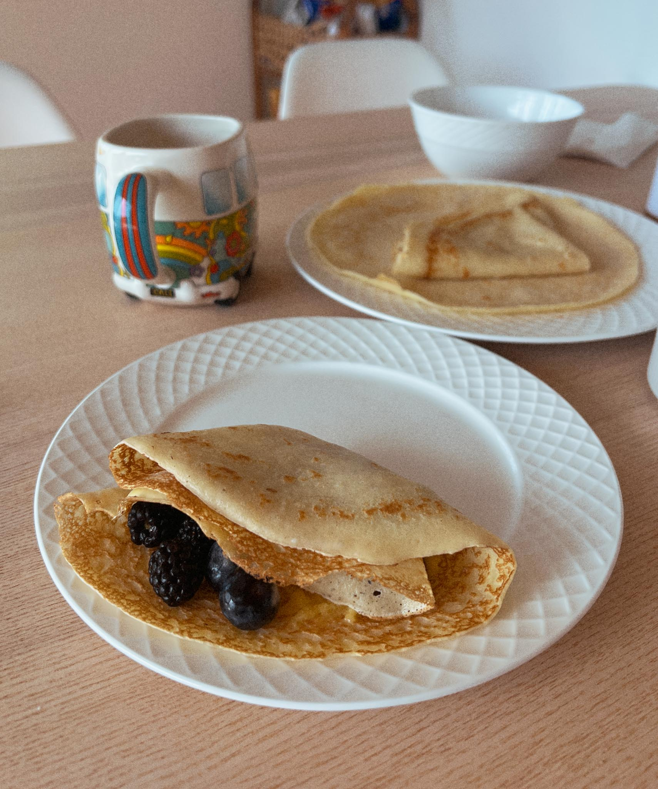
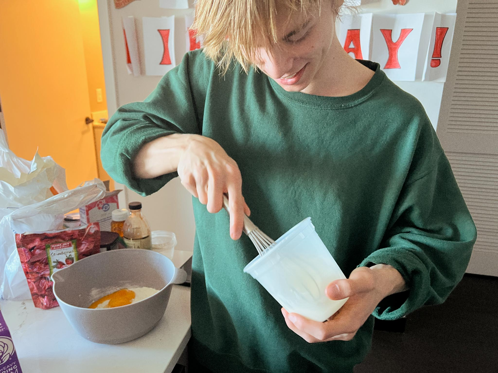

---
title: crepes
...

### summary
a breakfast classic, made on countless, both savory and sweet occasions.

### ingredients
- 2 large eggs
- ½ cup milk
- ½ cup water
- ¼ teaspoon salt
- 1 cup all-purpose flour
- 2 tablespoons butter, melted

### method
1. Whisk eggs, milk, water, and salt together in a large mixing bowl; add flour and butter and whisk vigorously until smooth.
2. Heat a lightly oiled griddle or frying pan over medium-high heat. Pour or scoop the batter onto the pan, using approximately 1/4 cup for each crêpe. Tilt the pan with a circular motion so that the batter coats the surface evenly.
3. Cook until the top of the crêpe is no longer wet and the bottom has turned light brown, 1 to 2 minutes. Run a spatula around the edge of the skillet to loosen the crêpe; flip and cook until the other side has turned light brown, about 1 minute more. Serve hot.

