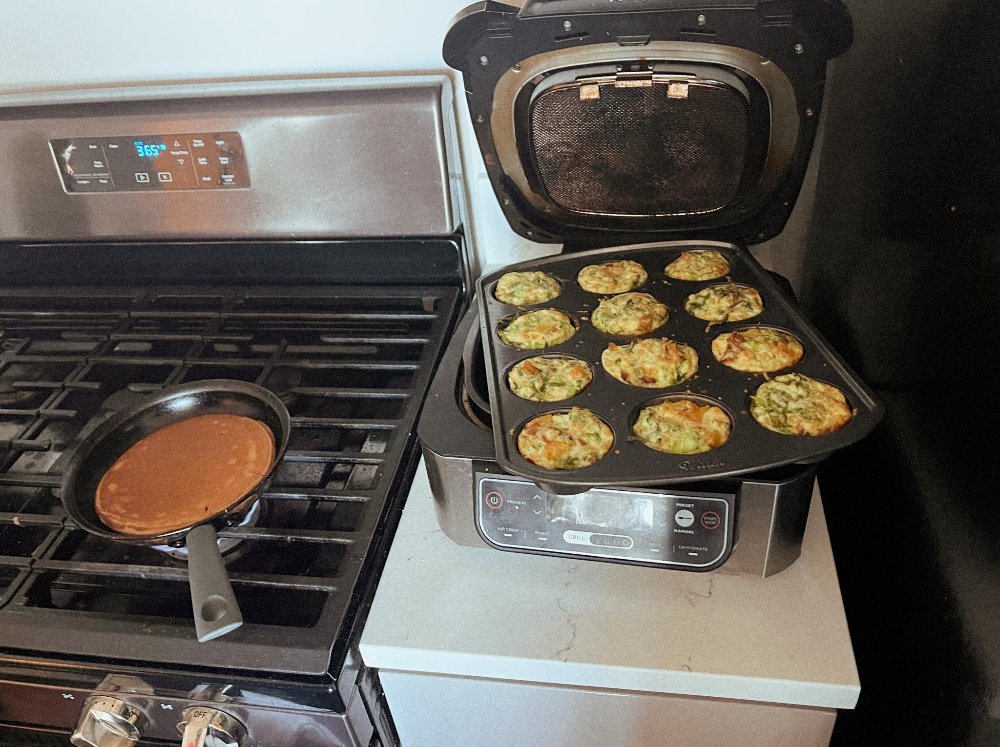

---
title: egg white bites
keywords: [egg white bites]
...

### summary
for when lillian has too many egg whites after her mass tiramisu baking adventures

### ingredients
- 1 (16 ounce) carton liquid egg whites, or just whatever is leftover
- ½ cup low-fat cottage cheese
- ¼ teaspoon garlic powder
- ¼ teaspoon salt
- ⅛ teaspoon ground black pepper
- 1 cup packed fresh spinach, finely chopped
- ⅓ cup roasted red peppers, drained and chopped
- 1 tablespoon fresh basil, minced
- ¼ cup crumbled feta cheese

### method
1. Preheat the oven to 350 degrees F (175 degrees C). Spray a 12-cup muffin pan generously with cooking spray.
2. Combine egg whites, cottage cheese, garlic powder, salt, and pepper
3. Combine spinach, roasted red peppers, and basil in a bowl. Pour in egg mixture and stir to combine.
4. Ladle the mixture evenly into the muffin cups, filling each about 3/4 full.
5. Top with feta
6. Bake in the preheated oven until egg white bites are set, 18 to 20 minutes.

