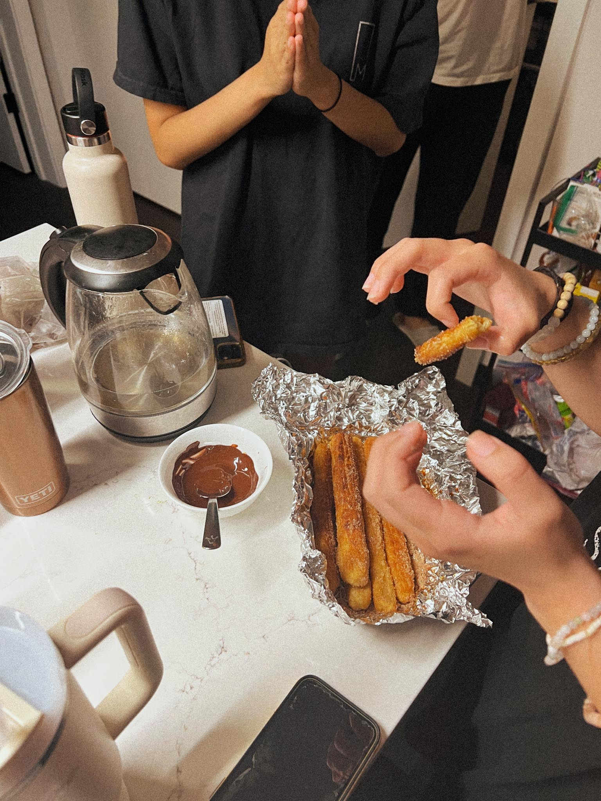

---
title: churros
keywords: [churros]
...

### summary
word

### ingredients

|Ingredients|Quantity|
|----|----|
|Water|250 ml|
|Flour|120g|
|Salt|3/4 Tsp|
|Unsalted Butter|5 Tbsp|
|Egg|1|
|Oil|Enough to fry...|
|Vanilla Extract|1 Tsp|
|Granulated Sugar|2 Tbsp(dough)+100g(coating)|
|Cinnamon|1 Tbsp|

*1 serving: ~5 churros

### method
### Make the dough:
1. Add water, sugar, salt, and butter to a saucepan on Med-Hi.
2. Bring to a boil while stirring together, then kill heat.
3. Stir in vanilla extract until homogenous.
4. Stir in flour until smooth and thickened - should look like play dough.
5. Allow to cool ~5-10 min.

### Shape & Fry
1. Shape dough into churros of the preferred size. Too large and the center will not cook, so be cautious. Low heat cannot save a poorly rolled churro.
2. Using a fork, create grooves in the churros side to give the classic texture.
3. Fry on med heat until golden brown on the outside. When fried, remove from pan and let dry on a paper towel to remove grease.
4. Let cool until @ desired temp.
    
### Make the coating and dip
1. Combine sugar and cinnamon in a flat pan/plate and roll fried churros until coated thoroughly.

### Enjoy

