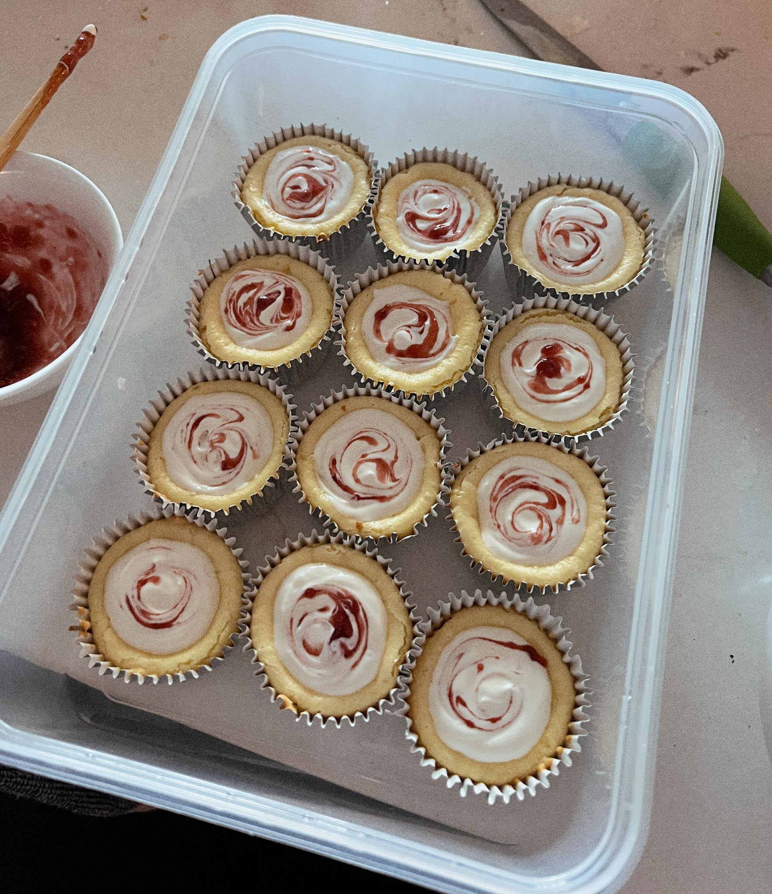

---
title: mini cheesecake cups
keywords: [mini cheesecake cups]
...

### summary
a classic recipe given to me secretly by a mom on a notecard, now made public, sorry.

### ingredients
Makes 15
- Sturdy cupcake liners
- Real Nilla wafers, or mushed up graham crackers, oreos, or biscoff cookies with butter
- 2 8 oz Cream Cheese (room temp)
- 2 Eggs
- ¾ cup sugar
- ½ tsp vanilla
- Optional: sour cream topping (its just sour cream and sugar)

### method
- Preheat oven
- Blend all four ingredients until smooth
- Place nilla wafer at the base of each cupcake liner
- Fill each to ¾ full
- Bake 20 min at 350 or until cracked

