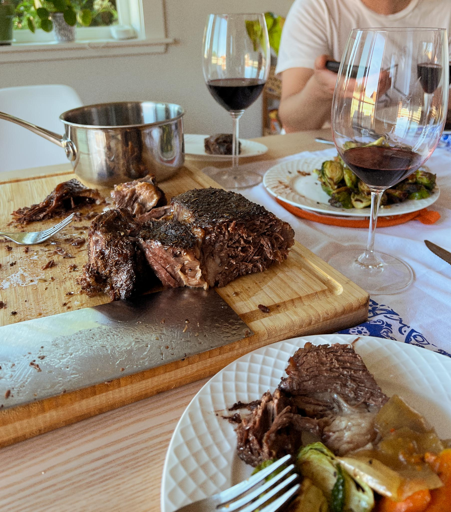

---
title: slow roast beef
keywords: [slow roast beef]
...

### summary
word

### ingredients
- top round roast beef?

### method
=== one day prior:

- Salt, dry rub with prime rib rub can get at qfc
- Needs rosemary salt pepper garlic powder
- Organic no salt seasoning too,
- “Flavor blast it”

===

=== present
- Preheat oven 350
- Sear on a cast iron or Dutch oven all sides, 10-12 minutes until it looks like a crispy steak on outside
- Cut up carrot onion celery pour beef stock in, maybe red wine up to halfway roughly
- Lid the Dutch oven or tin foil over cast iron
- Cook for 4-5 hours until it falls apart
- Last 40 minutes take off lid to let brown and crisp up

===

